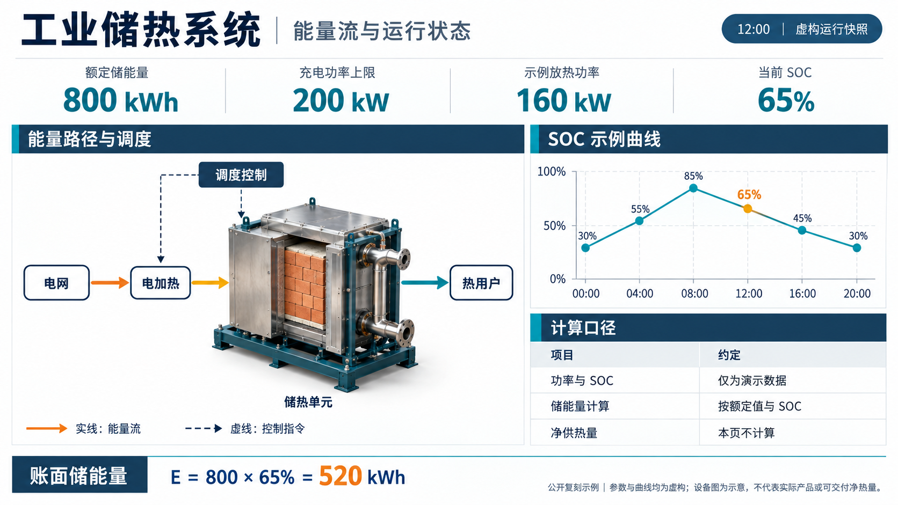
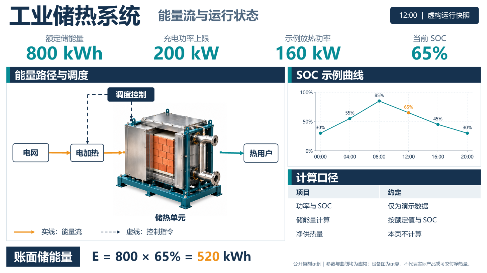

# 工业储热系统：能量流与运行状态

一页包含状态指标、设备主视觉、能量与控制连接、SOC 科研曲线、原生表格和公式文本的公开复刻示例。所有参数和曲线均为虚构；设备为生成的示意图，不代表真实产品或实际净供热能力。

## 看效果

| 生成的参考图 | 重建后的 PowerPoint 实际渲染 |
|---|---|
|  |  |

[下载可编辑 PPTX](rebuilt.pptx) · [查看编辑演示](edit-demo.png) · [编辑检查结果](edit-checks.json)

编辑演示修改了标题、一个表格单元格，移动了流程节点、指标分组及曲线图片，并保存重开。原始 PPT 保持不变。

## 对象与编辑方式

- 标题、指标、图例、节点标签、公式：PowerPoint 原生文字。
- 计算口径：原生表格，可修改单元格。
- 能量箭头与控制线：原生连接对象；节点编辑测试检查了连接保持。
- SOC 曲线：MATLAB 导出的高清 PNG，PPT 中可整体排版；随附 MATLAB 和 Python 脚本及源数据。
- 设备：独立无字图片；图片内部的砖块、管道等不承诺逐项编辑。
- 公式为可编辑文本，不是 Office 公式对象；本例没有原生 chart，也不测试该能力。

## 重绘曲线

先修改 [data.json](data.json)。两个工具使用同一组数据，字体与抗锯齿会产生视觉差异，不要求像素相同。

这是固定布局样例：保留六个时点 `00:00、04:00、08:00、12:00、16:00、20:00`，橙色标记固定指向第四点，页面快照固定显示 `12:00`。修改 SOC 时，同时更新 `soc` 与 `soc_series` 的第四项，避免指标与曲线不一致。改变时点、样本数或快照时间需要同步修改两份绘图脚本和构建脚本；`snapshot` 字段目前不会自动驱动布局。接近 100% 的标注及更长的数字也需要重新检查边界和排版。

Python 路线：

```sh
python -m pip install matplotlib==3.10.8
python plot_soc.py
```

MATLAB 路线：在本目录执行：

```matlab
plot_soc
```

两条路线均输出 `soc-curve.svg` 和 `soc-curve.png`；默认会替换本目录的同名导出图。需保留原图时，Python 用 `--out-dir` 指定另一个目录，MATLAB 用 `plot_soc('另一个输出目录')`。

## 构建 PPT

无论曲线由 MATLAB 还是 Python 生成，构建 PPT 都需要 Python。下载完整示例目录，在该目录安装[构建依赖](requirements.txt)：

```sh
python -m pip install -r requirements.txt
```

保持 `equipment.png`、`soc-curve.png`、`data.json` 与构建脚本相邻：

```sh
python build_example.py --out rebuilt.pptx
```

此脚本针对本页固定布局，不会自动分析另一张参考图。修改标题、指标等布局时编辑构建脚本；修改数据后重新绘图并构建，避免曲线与页面状态不同步。

Windows 安装 Microsoft PowerPoint 后，可使用 PowerShell 验证：

```powershell
./verify_example.ps1 -InputPptx ./rebuilt.pptx -OutputDir ./verification
```

验证脚本在指定目录创建编辑副本及预览，保留输入文件；使用独立输出目录避免覆盖已有验证产物。编辑副本用于演示，不能作为原始计算版本。

## 已验证范围与差距

- PPT 构建已验证：Python 3.12.14、python-pptx 1.0.2、Pillow 12.3.0。Python 绘图已验证：Python 3.14.2、Matplotlib 3.10.8；这两条路径在不同 Python 环境执行，不表示所有依赖组合均已验证。
- 本机实际运行 MATLAB R2023b 和 Python/Matplotlib 绘图，两者均生成 SVG 与 PNG。
- PPT 和 MATLAB 脚本使用 Microsoft YaHei；字体不随仓库分发，缺少时需选择可用中文字体并重新检查换行。PowerShell 验证脚本仅适用于装有桌面版 PowerPoint 的 Windows；其他平台可构建，但本仓库未验证其渲染与编辑结果。
- 实际使用 PowerPoint 16.0 打开、渲染、编辑、保存及重开；检查结果见上方 JSON。
- 字体字重、图表渲染、设备分离后的微小纹理与连接角度相较参考有差异；不承诺像素级一致。
- 设备图由图像工具分离和修复，未能确认实际模型型号。只公开最终无字素材；不包含私人项目资料。
- 本例只说明这一页的交付结果，不代表任意页面的成功率，也不是与其他 Skill 的同图性能比较。

## 文件许可

代码和文档适用仓库 MIT 许可证。参考图与设备图为本示例生成的视觉素材，允许随本示例使用；不代表真实设备认证、产品设计或性能承诺。
